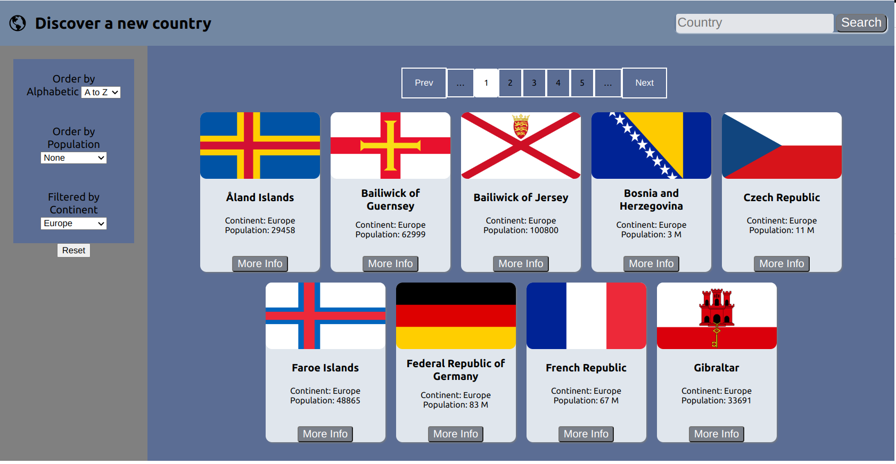
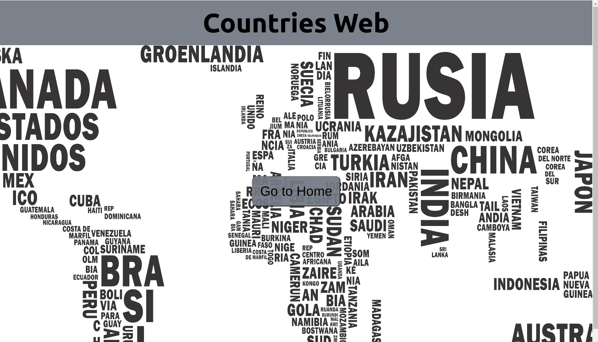
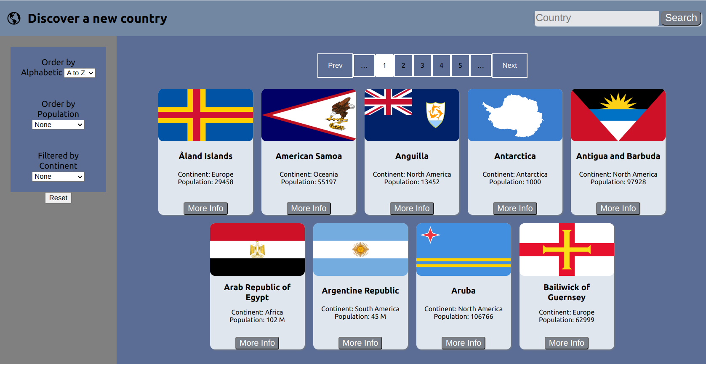

# Countries web

## Search by filter
<p align="center">
  
</p>

## Landing
<p align="right">
  
</p>

## Home
<p align="right">
  
</p>
# ¿quieres replicar este proyecto?

necesitas
 * __Node__: 12.18.3 o mayor
 * __NPM__: 6.14.16 o mayor

Para verificar que versión tienen instalada:

> node -v
>
> npm -v


El boilerplate cuenta con dos carpetas: `api` y `client`. En estas carpetas estará el código del back-end y el front-end respectivamente.

En `api` crear un archivo llamado: `.env` que tenga la siguiente forma:

```
DB_USER=usuariodepostgres
DB_PASSWORD=passwordDePostgres
DB_HOST=localhost
```

Reemplazar `usuariodepostgres` y `passwordDePostgres` con tus propias credenciales para conectarte a postgres. Este archivo va ser ignorado en la subida a github, ya que contiene información sensible (las credenciales).

Adicionalmente será necesario que creen desde psql una base de datos llamada `countries`

El contenido de `client` fue creado usando: Create React App.
